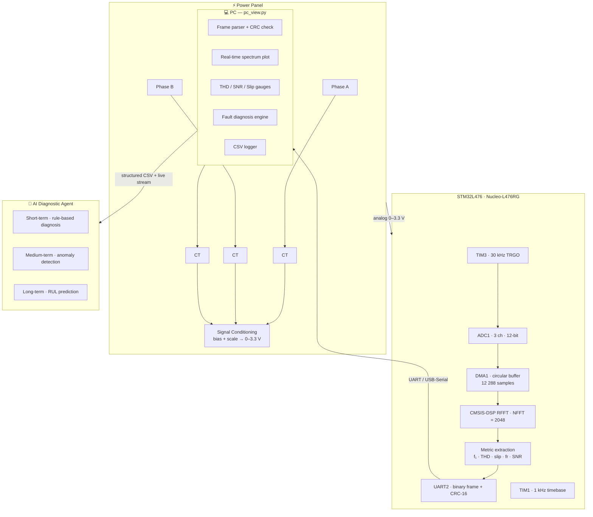
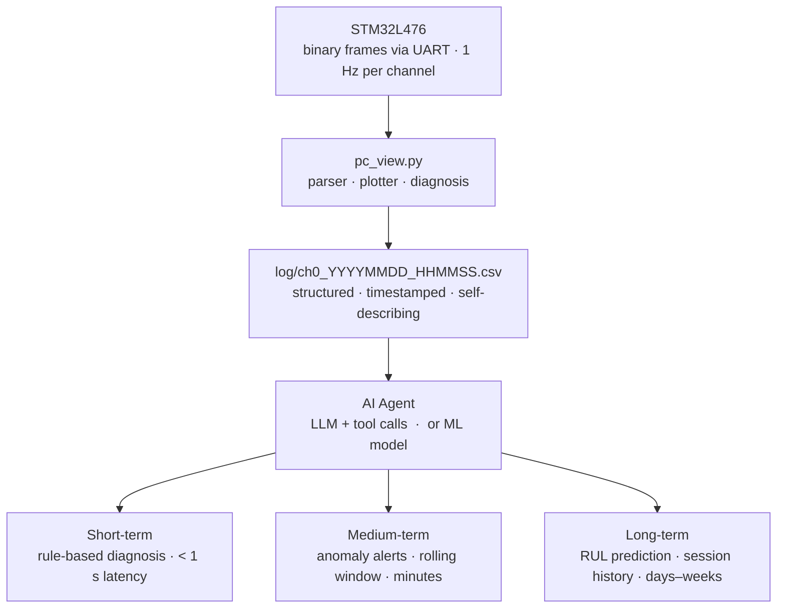
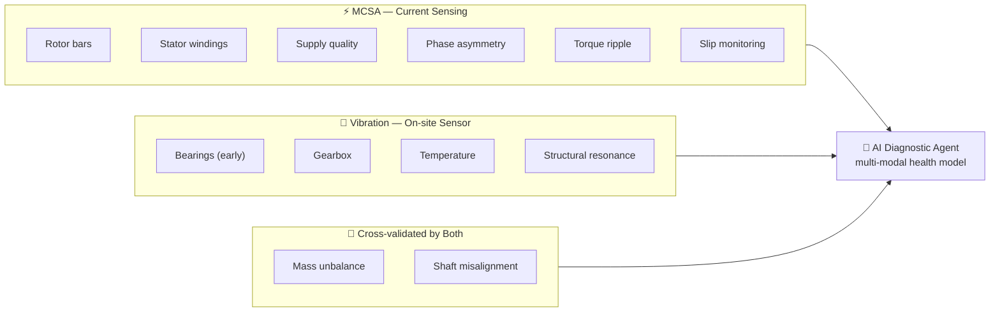
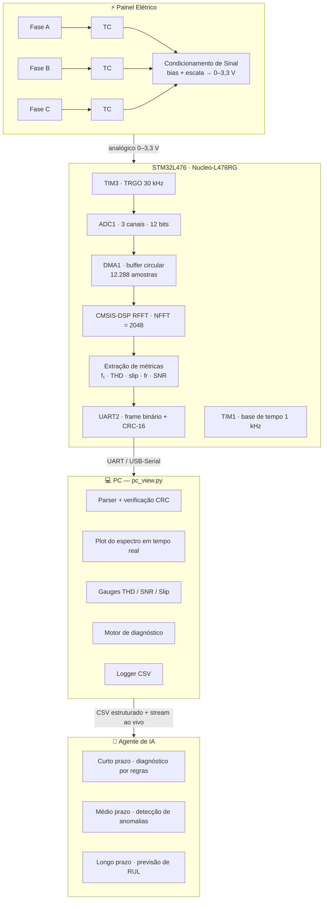
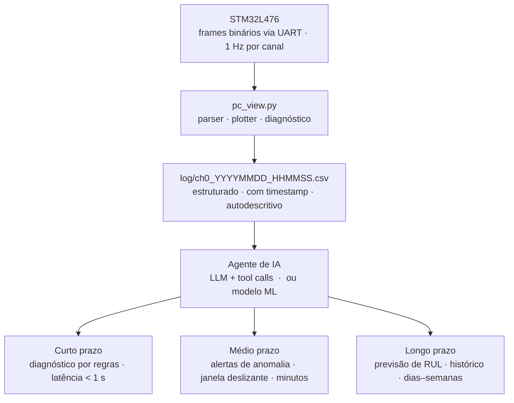
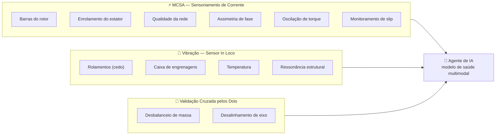

# Engine MCSA Analyzer

> **Motor Current Signature Analysis on bare-metal STM32 — feeding AI agents for predictive maintenance**

---

## Table of Contents

1. [The Problem Worth Solving](#1-the-problem-worth-solving)
2. [The Insight: Motors Tell Their Own Story](#2-the-insight-motors-tell-their-own-story)
3. [System Architecture Overview](#3-system-architecture-overview)
4. [Hardware Design](#4-hardware-design)
5. [Firmware Deep Dive](#5-firmware-deep-dive)
6. [The Mathematics Behind It](#6-the-mathematics-behind-it)
7. [Binary Protocol & PC Viewer](#7-binary-protocol--pc-viewer)
8. [Current Diagnostics & Detectable Faults](#8-current-diagnostics--detectable-faults)
9. [AI Agent Integration](#9-ai-agent-integration)
10. [Roadmap](#10-roadmap)
11. [MCSA vs. On-site Vibration Sensors](#11-mcsa-vs-on-site-vibration-sensors)
12. [The Power of Combining Both](#12-the-power-of-combining-both)
13. [Getting Started](#13-getting-started)

---

## 1. The Problem Worth Solving

Unplanned motor failures cost the global industry billions of dollars every year — not primarily in replacement parts, but in **unscheduled downtime**, emergency labor, cascading process failures, and safety incidents. The electric motor is the backbone of industrial automation: pumps, compressors, fans, conveyors, mixers. When one stops without warning, it rarely stops alone.

The traditional answer has been either **run-to-failure** (cheap until it isn't) or **time-based preventive maintenance** (expensive and often unnecessary — replacing parts that still had months of life left). The smarter answer is **condition-based predictive maintenance**: only intervene when the machine actually tells you something is wrong.

The question is: how do you listen?

---

## 2. The Insight: Motors Tell Their Own Story

An induction motor is not just a mechanical device — it is an **electromechanical transducer**. Every mechanical event inside it (a developing crack in a rotor bar, a worn bearing, a shaft misalignment) modulates the magnetic flux in the air gap, which in turn modulates the **stator current** drawn from the supply. The motor's own phase currents carry a rich spectral signature of everything happening inside.

This technique is called **Motor Current Signature Analysis (MCSA)**. It requires no physical access to the motor. Sensors live in the **control panel** — far from heat, vibration, chemicals, and tight spaces. One measurement point. Continuous, non-intrusive monitoring.

This project implements a full MCSA pipeline on a **bare-metal STM32 microcontroller**: real-time acquisition of three-phase currents, spectral analysis using the CMSIS-DSP FFT library, extraction of electromechanical health metrics, and streaming of structured binary frames to a PC — where data is visualized, logged to CSV, and ready to be consumed by AI diagnostic agents.

---

## 3. System Architecture Overview



---

## 4. Hardware Design

### 4.1 Microcontroller

| Parameter | Value |
|---|---|
| MCU | STM32L476RG (Cortex-M4F, FPU) |
| Clock | 80 MHz (HSI 16 MHz → PLL: PLLM=1, PLLN=10, PLLR=2) |
| Flash | 1 MB |
| RAM | 128 KB |
| Development board | NUCLEO-L476RG |

The Cortex-M4 FPU is critical here: all DSP operations run in single-precision floating point in hardware, enabling the full FFT pipeline to complete well within the 33 ms window between consecutive DMA half-buffers.

### 4.2 Current Sensing Front-End

Three-phase motor currents are acquired via **current transformers (CTs)** or **Hall-effect sensors**. The analog output of each sensor is conditioned with:

- A **burden resistor** to convert current to voltage (CT case)
- A **DC bias** of ~1.65 V (half of Vdd = 3.3 V) to center the AC waveform in the ADC input range
- An **RC anti-aliasing low-pass filter** with cutoff well below the Nyquist frequency (5 kHz)

The conditioned signals connect to three ADC channels:

| Phase | ADC Channel | GPIO Pin |
|---|---|---|
| Phase A | ADC1_IN5 | PA0 |
| Phase B | ADC1_IN6 | PA1 |
| Phase C | ADC1_IN9 | PB0 |

### 4.3 Sampling Clock — TIM3

TIM3 generates the **ADC trigger** (TRGO on Update event):

```
f_TIM3 = SYSCLK / ((PSC + 1) × (ARR + 1))
       = 80,000,000 / (3 × 889)
       = 80,000,000 / 2,667
       ≈ 30,000 Hz  (30 kHz total)
```

Since the ADC scans 3 channels per trigger, each channel is sampled at:

```
Fs_per_channel = 30,000 / 3 = 10,000 Hz  (10 kS/s)
```

With NFFT = 2048 and Fs = 10 kHz, the **frequency resolution** is:

```
Δf = Fs / N = 10,000 / 2048 ≈ 4.88 Hz
```

And the **Nyquist limit** is 5 kHz — well above the frequency range of interest for MCSA (0–1 kHz).

### 4.4 DMA Buffer

The ADC stores samples in an interleaved circular DMA buffer in RAM:

```
adc_buffer[ADC_DMA_LEN]  where  ADC_DMA_LEN = 3 × 2 × 2048 = 12,288 samples

Memory layout (interleaved):
[ ch0 | ch1 | ch2 | ch0 | ch1 | ch2 | ... ]
  t=0   t=0   t=0   t=1   t=1   t=1

Half-buffer (DMA Half-Complete):  offset 0      → 6,144 samples → 2,048 per channel
Full buffer  (DMA Full-Complete):  offset 6,144  → 6,144 samples → 2,048 per channel
```

DMA operates in **circular double-buffer mode**: while the firmware processes the first half, the DMA fills the second half — and vice versa. This guarantees zero dead time.

### 4.5 Timebase — TIM1

TIM1 provides the 1 kHz system tick for the heartbeat:

```
f_TIM1 = 80,000,000 / (80 × 1,000) = 1,000 Hz
```

### 4.6 Data Output — UART2

Binary frames are transmitted via USART2 at **115,200 baud** (upgradable to 921,600 baud for higher throughput). The PC viewer connects via any USB-to-serial adapter.

---

## 5. Firmware Deep Dive

### 5.1 Cooperative Main Loop (`app.c`)

The firmware runs **bare-metal** (no RTOS). The main loop uses `__WFI()` (Wait For Interrupt) to sleep between events, achieving near-zero idle CPU load:

```c
for (;;) {
    __WFI();                          // sleep until interrupt

    if (dma_half_ready) {
        dma_half_ready = 0;
        process_block(0);             // process first half
    }
    if (dma_full_ready) {
        dma_full_ready = 0;
        process_block(ADC_DMA_LEN/2); // process second half
    }

    if ((millis_tick - last_hb_ms) >= 1000) {
        process_print_metrics_all();  // UART debug print
        mcsa_stream_send_channel(ch); // binary frame to PC
    }
}
```

HAL callbacks are kept **minimal** — they only set flags. All heavy processing happens in the main loop context.

### 5.2 DSP Initialization (`dsp_init`)

Before acquisition starts, the firmware pre-computes the **Hann window** coefficients and initializes the RFFT instance:

```c
for (uint32_t n = 0; n < NFFT; n++) {
    float theta = (2π × n) / (NFFT − 1);
    hann_window[n] = 0.5f × (1.0f − cos(theta));
}
arm_rfft_fast_init_f32(&rfft_instance, NFFT);
```

### 5.3 Block Processing (`process_block`)

Each half-buffer callback triggers the full pipeline:

1. **De-interleave** — split the interleaved DMA buffer into three separate channel arrays (int16)
2. **DC removal** — subtract the mean value from each channel
3. **Per-channel pipeline:** convert int16 → float, apply Hann window, compute RFFT, compute magnitude spectrum
4. **Metric extraction** — call `mcsa_extract_metrics()` for each channel
5. **Store results** — update global metrics and spectrum arrays for the stream module

---

## 6. The Mathematics Behind It

### 6.1 ADC Quantization

The 12-bit ADC maps the input range [0, Vref] to integer codes [0, 4095]:

```
x_raw[n] ∈ {0, 1, ..., 4095}    (12-bit unsigned)
```

After DC removal, the zero-mean int16 signal is scaled to a normalized float:

```
x[n] = (x_raw[n] − DC) / 2048.0
```

The factor 2048 (= 2¹¹) maps the signed range [−2048, +2047] approximately to [−1.0, +1.0].

### 6.2 Windowing (Hann)

A rectangular window causes **spectral leakage** — energy from a strong tone bleeds into adjacent bins, masking weaker components. The **Hann window** suppresses this at the cost of slightly wider main lobes:

```
w[n] = 0.5 × (1 − cos(2π·n / (N−1))),    n = 0, 1, ..., N−1
```

The windowed signal fed to the FFT:

```
x_w[n] = x[n] × w[n]
```

| Window | Main lobe width | Side lobe level |
|---|---|---|
| Rectangular | 2 bins | −13 dB |
| Hann | 4 bins | −32 dB |

For MCSA, the Hann window is a good trade-off: motor fault sidebands are typically 20–40 dB below the fundamental, requiring good side-lobe rejection.

### 6.3 Real FFT (RFFT)

For a real input signal of length N, the CMSIS-DSP `arm_rfft_fast_f32` computes the N/2 + 1 unique complex spectral bins using a radix-2 Cooley-Tukey algorithm:

```
X[k] = Σ_{n=0}^{N-1} x_w[n] · e^{−j·2π·k·n/N},    k = 0, 1, ..., N/2
```

The output is packed as: `[Re(X[0]), Re(X[N/2]), Re(X[1]), Im(X[1]), Re(X[2]), Im(X[2]), ...]`

**Computational cost:** O(N log₂ N). For N = 2048: ~22,528 multiply-add operations — the Cortex-M4 FPU completes this in microseconds.

### 6.4 Magnitude Spectrum

The one-sided magnitude spectrum (N/2 + 1 bins):

```
|X[k]| = √(Re²[k] + Im²[k]),    k = 0, 1, ..., N/2
```

The CMSIS function `arm_cmplx_mag_f32` computes this using the hardware FPU in a vectorized loop.

**Frequency axis mapping:**

```
f[k] = k · Fs / N = k · 10000 / 2048 ≈ k × 4.88 Hz
```

So bin k = 12 corresponds to ≈ 58.6 Hz, bin k = 13 to ≈ 63.5 Hz (bracketing the 60 Hz fundamental).

### 6.5 Fundamental Detection

The mains fundamental f₁ is found by searching for the peak magnitude within a ±5 Hz window around the nominal supply frequency (60 Hz):

```
k_lo = round((f_nominal − Δf_search) · N / Fs)
k_hi = round((f_nominal + Δf_search) · N / Fs)

k_f1 = argmax_{k ∈ [k_lo, k_hi]} |X[k]|

f₁ = k_f1 · Fs / N
A₁ = |X[k_f1]|
```

This adaptive search handles small grid frequency deviations (typically ±0.5 Hz in industrial grids).

### 6.6 Harmonic Distortion and THD

Odd harmonics (3rd, 5th, 7th, 9th) of the supply current are characteristic of non-linear loads and certain motor faults. For each harmonic of order h:

```
f_h = h · f₁
k_h = argmax_{k ∈ [k_h−1, k_h+1]} |X[k]|     (peak search ±1 bin)
A_h = |X[k_h]|
```

Total Harmonic Distortion (THD) relative to the fundamental:

```
THD = √(A₃² + A₅² + A₇² + A₉²) / A₁
```

A THD > 10% in the current waveform suggests significant non-linearity — either from the power supply, the drive electronics, or internal motor asymmetries.

### 6.7 Rotor Fault Sidebands and Slip Estimation

A healthy induction motor running at slip `s` produces **rotor fault sidebands** in the current spectrum at:

```
f_sb = f₁ × (1 ± 2·s)
```

Where slip `s` is defined as:

```
s = (n_s − n_r) / n_s
```

- `n_s` = synchronous speed (rpm) = 120·f₁/p (p = number of poles)
- `n_r` = actual rotor speed (rpm)

Broken or cracked rotor bars amplify these sidebands significantly. The firmware searches for the pair of symmetric sidebands (f_low, f_high) around f₁ that maximizes the sum `A_low + A_high` within the expected slip range [0.5%, 8%]:

```
Δf_d = d · Fs / N    (d = bin offset from f₁)

For d = d_min to d_max:
    f_low  = f₁ − d · Δf
    f_high = f₁ + d · Δf
    score  = |X[k_low]| + |X[k_high]|

best_d → slip_est = best_d · (Fs/N) / (2 · f₁)
```

The **sideband ratio** to the fundamental is a quantitative fault indicator:

```
SB_ratio = (A_low + A_high) / A₁
```

A healthy motor typically shows SB_ratio < 0.05. Values > 0.15 warrant investigation.

### 6.8 Mechanical Frequency and Eccentricity

The rotor mechanical frequency `fr` (shaft speed in Hz) appears in the current spectrum due to air-gap eccentricity, mass unbalance, or misalignment. The firmware searches the range [2, 100] Hz for the dominant peak outside the mains notch:

```
fr = argmax_{f ∈ [2 Hz, 100 Hz], f ∉ [f₁−Δ, f₁+Δ]} |X[k]|
```

The second harmonic `2·fr` is also extracted. Their amplitudes relative to A₁ allow classification:

```
amp_fr / A₁ > 0.20  AND  amp_2fr / A₁ < 0.10  →  likely mass unbalance
amp_2fr / A₁ > 0.15                              →  likely misalignment or mechanical looseness
```

### 6.9 Noise Floor and SNR

The average noise floor is estimated from the spectral bins in the range [300 Hz, 1000 Hz], excluding the fundamental and its harmonics:

```
noise_avg = mean{ |X[k]| : f[k] ∈ [300, 1000] Hz,
                            f[k] ∉ {f₁ ± 2Δf, f₃ ± 2Δf, f₅ ± 2Δf, ...} }

noise_floor_dB = 20 · log₁₀(noise_avg / A₁)
SNR_dB = −noise_floor_dB
```

A low SNR (< 12 dB) means the measurement environment is noisy and fault signatures may be unreliable. This flag gates all diagnostic outputs.

---

## 7. Binary Protocol & PC Viewer

### 7.1 Frame Structure

Every second, the firmware serializes one binary frame per channel over UART. The format is little-endian:

| Offset | Size | Type | Field |
|---:|:---:|:---:|---|
| 0 | 2 | `u16` | Magic: `0xA55A` |
| 2 | 1 | `u8` | Protocol version (1) |
| 3 | 1 | `u8` | Channel ID (0–2) |
| 4 | 4 | `u32` | NFFT |
| 8 | 4 | `f32` | Fs per channel (Hz) |
| 12 | 2 | `i16` | DC offset removed (ADC counts) |
| 14 | 4 | `f32` | f₁ (Hz) |
| 18 | 4 | `f32` | A₁ (magnitude) |
| 22 | 4 | `f32` | THD (ratio) |
| 26 | 4 | `f32` | SNR (dB) |
| 30 | 4 | `f32` | Slip estimate |
| 34 | 4 | `f32` | fr (Hz) |
| 38 | 4 | `f32` | Amplitude at fr |
| 42 | 4 | `f32` | Amplitude at 2·fr |
| 46 | 2 | `u16` | Number of harmonics N_h |
| 48 | N_h × 10 | — | Harmonics: `[u16 order, f32 freq_hz, f32 amplitude]` × N_h |
| — | 2 | `u16` | Number of spectrum bins N_bins |
| — | N_bins × 4 | `f32[]` | Magnitude spectrum bins \[0 .. F\_SPEC\_MAX\_HZ\] |
| — | 2 | `u16` | CRC-16/CCITT (over all fields from version to last bin) |

The transmitted spectrum covers 0–1000 Hz (205 bins), keeping frame size manageable while capturing all diagnostically relevant frequencies.

### 7.2 CRC-16/CCITT Integrity

Each frame is protected by CRC-16/CCITT (polynomial 0x1021, init 0xFFFF), computed over all payload bytes from `version` to the last spectrum bin. The PC viewer discards frames with CRC mismatches — preventing corrupted data from reaching the AI pipeline.

### 7.3 PC Viewer (`pc_view.py`)

The Python viewer runs on any PC with `pyserial` and `matplotlib`:

```
python pc_view.py --port /dev/ttyUSB0 --baud 115200 --ch 0
```

Features:
- **Real-time spectrum plot** with session-persistent Y-axis scaling
- **Color-coded gauges** for THD, SNR, and Slip
- **Diagnostic overlays** on the spectrum plot (E=red, W=orange, I=green)
- **CSV logging** with ISO timestamps, all metrics, and diagnostic flags per frame
- **Terminal output** with per-second summary and session/per-minute event counters

---

## 8. Current Diagnostics & Detectable Faults

### 8.1 Fault Table

| Fault | Detection Method | Severity Threshold | Notes |
|---|---|---|---|
| **Broken / cracked rotor bars** | Sideband ratio > 0.15 at (1±2s)·f₁ | W above 0.15, E above 0.30 | Requires SNR > 12 dB |
| **Rotor bar degradation (early)** | Slip drift > 3% with stable load | W | Trending over sessions |
| **Mass unbalance** | amp_fr/A₁ > 0.20 with amp_2fr/A₁ < 0.10 | W | Shaft speed must be identifiable |
| **Misalignment / mechanical looseness** | amp_2fr/A₁ > 0.15 | W | Also check 3×fr |
| **Stator current THD (high)** | THD > 15% | E | Supply or winding issue |
| **Stator current THD (moderate)** | THD 10–15% | W | Monitor trend |
| **Stator current THD (notice)** | THD 5–10% | I | May be normal for VFD loads |
| **Low SNR / noisy measurement** | SNR < 12 dB | I | Flags all diagnostics as unreliable |

### 8.2 Diagnostic Output Example (CSV row)

```csv
2025-10-18T20:52:10,0,2048,10000.000,1483,63.47,0.139,1.237,6.188,0.038,
34.18,0.182,0.138,"[(3,195.3,0.122),(5,312.5,0.071),(7,439.5,0.061),(9,571.3,0.078)]",
[W] Misalignment probable | [E] THD > 15% | [I] Low SNR,0,0,0,1,1,0,0,1
```

---

## 9. AI Agent Integration

The system is architected from the ground up as a **data source for AI diagnostic agents**. The CSV log and real-time binary stream provide a structured, timestamped, multi-feature time series that is directly consumable by machine learning pipelines.

### 9.1 What Each Frame Provides to an AI Agent

Each second, an agent receives:

```json
{
  "timestamp": "2025-10-18T20:52:10",
  "channel": 0,
  "f1_hz": 63.47,
  "a1": 0.139,
  "thd": 1.237,
  "snr_db": 6.19,
  "slip_est": 0.038,
  "fr_hz": 34.18,
  "a_fr": 0.182,
  "a_2fr": 0.138,
  "harmonics": [[3, 195.3, 0.122], [5, 312.5, 0.071], ...],
  "spectrum": [0.001, 0.003, ..., 0.139, ..., 0.008],  // 205 bins, 0–1000 Hz
  "diagnostics": ["[W] Misalignment", "[E] THD > 15%"]
}
```

### 9.2 Predictive Maintenance Agent Capabilities

**Reactive diagnostics (current):** Rule-based thresholds provide immediate fault flags — rotor bars, unbalance, misalignment, THD. These run on the embedded firmware itself.

**Predictive diagnostics (roadmap):** The structured time series enables:

- **Trend analysis:** Gradual drift of `slip_est`, `thd`, `a_fr` over days or weeks — the motor tells you 2–6 weeks before a mechanical failure that something is changing
- **Anomaly detection:** Autoencoders or isolation forests trained on healthy-motor spectrum data flag deviations before they cross hard thresholds
- **Fault classification:** Multi-class classifiers (SVM, CNN on spectrum images, LSTM on time series) can distinguish broken bars from unbalance from misalignment with high confidence when trained on labeled datasets
- **Remaining Useful Life (RUL) estimation:** Regression models on trending features estimate how many operating hours remain before intervention is required
- **Multi-motor correlation:** With multiple units feeding the same agent, cross-motor anomalies (supply-side issues vs. motor-specific) can be disambiguated

### 9.3 Data Pipeline



The CSV schema is intentionally flat and self-describing, making it trivial to load into pandas, feed into a vector database for RAG-based agents, or stream into time-series databases like InfluxDB or TimescaleDB.

---

## 10. Roadmap

### Short Term (next firmware/software iterations)

- [ ] **Expand NFFT to 4096** — doubles frequency resolution to ~2.44 Hz, enabling detection of low-speed mechanical components and sharper sideband discrimination (already stubbed in `config.h`)
- [ ] **Even harmonic detection** — add 2nd and 4th harmonics to identify asymmetric air-gap or supply-side issues
- [ ] **Eccentricity sidebands** — explicitly detect peaks at `f₁ ± fr` and `f₁ ± 2fr` as dedicated eccentricity indicators, separate from the existing `fr` amplitude check
- [ ] **Sub-harmonic detection** — search for peaks at `f₁/2` (~30 Hz) and `f₁/3` (~20 Hz), signatures of severe mechanical looseness or rub
- [ ] **Per-minute trending in CSV** — capture rolling statistics (mean, std) of key metrics to support lightweight trend alerts without an AI backend
- [ ] **Configurable nominal frequency** — support 50 Hz grids via runtime parameter, not just compile-time constant
- [ ] **UART baud rate increase to 921600** — reduce transmission latency for faster update rates

### Medium Term (hardware + algorithm extensions)

- [ ] **Voltage sensing (3 phases)** — add three voltage channels (resistive divider + isolation), unlocking:
  - Power factor (cos φ) and reactive power monitoring
  - Supply voltage THD and phase imbalance
  - Negative sequence component (I₂/I₁, V₂/V₁) for stator fault and supply asymmetry detection
  - Stator inter-turn short circuit detection via per-phase impedance asymmetry
  - Electromagnetic torque estimation via stator flux: `λ = ∫(V − Rs·I)dt`
- [ ] **Park's vector implementation** — transform 3-phase currents to `(id, iq)` in the rotating reference frame; analyze the current vector trajectory for rotor and stator asymmetries
- [ ] **Bearing fault detection** — if motor nameplate data (number of balls, bearing geometry) is provided, compute BPFO/BPFI frequencies and search for their sidebands in the spectrum
- [ ] **Motor startup transient capture** — record the full inrush and acceleration profile; asymmetries during starting reveal winding or rotor problems invisible in steady state
- [ ] **Online stator resistance estimation** — extract Rs from the V/I relationship to monitor thermal aging and inter-turn faults without a temperature sensor
- [ ] **MQTT / Wi-Fi gateway** — add an ESP32 or W5500 module to stream frames directly to a cloud MQTT broker, removing the PC-in-the-loop dependency

### Long Term (intelligence and scale)

- [ ] **Edge AI inference** — deploy a quantized anomaly detection model (TFLite Micro or STM32Cube.AI) directly onto the STM32, enabling real-time fault scoring without any PC
- [ ] **Multi-motor topology** — a single gateway node monitors N motors via multiplexed current sensing, building a plant-wide health dashboard
- [ ] **Fleet learning** — aggregate CSV data across multiple installations to train supervised fault classifiers on real-world labeled failures; continuously improve model accuracy with new data
- [ ] **LLM-powered diagnostic agent** — connect the structured CSV stream and metric API to a large language model with tool-use capabilities; the agent queries the motor's history, identifies patterns, cross-references with motor nameplate data, and generates human-readable maintenance recommendations
- [ ] **Digital twin integration** — parameterize a motor equivalent circuit model with the measured data to simulate what-if scenarios ("what if slip increases another 1%?") and generate physics-informed RUL estimates
- [ ] **IEC 61000 power quality compliance report** — automatically generate standardized reports on harmonic distortion, voltage imbalance, and frequency stability

---

## 11. MCSA vs. On-site Vibration Sensors

The market offers compact wireless sensors that attach directly to motor housings and measure vibration (accelerometer) and temperature continuously, transmitting data via Bluetooth or LoRa to cloud platforms with AI-driven diagnostics.

These are excellent tools — but they address a different part of the problem space. Understanding the distinction helps choose the right approach (or combination) for each application.

### 11.1 Where MCSA Has the Structural Advantage

**No physical access to the motor required.**
Current sensors live in the control panel — a clean, accessible, temperature-controlled environment. This is decisive for:
- Submerged motors (deep-well pumps, submersible agitators)
- Explosion-risk environments (ATEX zones) — installing a sensor on the motor requires zone-rated hardware and permitting
- High-temperature processes (furnaces, dryers, foundries)
- Encapsulated motors (IP67/IP68, totally enclosed)
- Motors at heights, in confined spaces, or behind rotating guards
- Retrofit scenarios where physical modification of the motor is not permitted

**Detects electrical faults that vibration cannot see.**
A cracked rotor bar, an inter-turn short circuit in the stator winding, or a developing winding asymmetry — these are electrical phenomena. They modulate current weeks before they produce measurable vibration. By the time vibration detects them, significant damage has occurred.

**One measurement point, multiple motors.**
With a multiplexed current measurement setup on a distribution panel, a single embedded system monitors an entire motor group. Vibration sensing requires one sensor per machine.

**No sensor degradation from the monitored environment.**
A piezoelectric accelerometer on a motor running at 300°C in a steel mill will degrade. A current transformer in the panel operates at room temperature regardless of what the motor is doing.

**Cost scales favorably.**
For plants with tens or hundreds of small motors (< 5 kW), instrumenting each unit with a wireless vibration sensor has significant cost and maintenance overhead. Current transformers are cheap, robust, and already present in many panels for protection purposes.

### 11.2 Where Vibration Sensing Has the Structural Advantage

**Bearing fault detection — dramatically superior sensitivity.**
Modern MEMS accelerometers capture signals up to 20–40 kHz. Incipient bearing defects generate high-frequency stress waves (envelope analysis in the 2–20 kHz range) that are almost invisible in the motor current. A well-configured vibration system typically detects a developing bearing failure **2–6 weeks earlier** than MCSA.

**Gearbox and mechanical drivetrain diagnostics.**
Gear mesh frequencies (number of teeth × shaft speed) and their sidebands live in the hundreds of Hz to several kHz range — a band where motor current has very poor signal-to-noise ratio. Vibration excels here.

**Physical fault localization.**
With multiple accelerometers or triaxial measurement, vibration can identify whether a defect is on the drive-end bearing, the non-drive-end bearing, or the gearbox. MCSA says "there is a bearing problem" but cannot localize it.

**Independence from electrical noise.**
Power quality issues, other loads on the same supply, variable frequency drives — all of these pollute the current spectrum. Vibration is immune to electrical interference.

**Temperature as an additional channel.**
Integrated temperature measurement in the same sensor provides a complementary health indicator, especially for overload detection and lubrication monitoring.

### 11.3 Summary Comparison

```mermaid
xychart-beta horizontal
    title "Capability Score (0–5)"
    x-axis ["Broken rotor bars", "Stator inter-turn", "Supply asymmetry", "Mass unbalance", "Misalignment", "Bearing faults (early)", "Gearbox", "Fault location", "Harsh environment", "Scalability"]
    bar "MCSA (current)" [5, 4, 5, 3, 3, 2, 2, 0, 5, 5]
    bar "Vibration (on-site)" [2, 1, 2, 4, 5, 5, 5, 4, 2, 3]
```



| Capability | MCSA (current) | Vibration (on-site) |
|---|:---:|:---:|
| Broken rotor bars | ●●●●● | ●●○○○ |
| Stator inter-turn faults | ●●●●○ | ●○○○○ |
| Supply asymmetry | ●●●●● | ●●○○○ |
| Mass unbalance | ●●●○○ | ●●●●○ |
| Shaft misalignment | ●●●○○ | ●●●●● |
| Bearing faults (early) | ●●○○○ | ●●●●● |
| Gearbox diagnostics | ●●○○○ | ●●●●● |
| Physical fault location | ○○○○○ | ●●●●○ |
| Harsh environment access | ●●●●● | ●●○○○ |
| Scalability (many motors) | ●●●●● | ●●●○○ |
| Installation complexity | Low — panel | Medium — on-motor |
| ATEX / hazardous area | Easy | Requires certification |
| Cost per motor (at scale) | Low | Medium–High |

---

## 12. The Power of Combining Both

Neither technology alone covers the full fault spectrum of an induction motor installation. Together, they are highly complementary with almost no overlap:



A combined system enables **cross-validation**: if vibration reports a mechanical anomaly but MCSA shows a clean spectrum, the fault is likely in the load or gearbox, not the motor. If MCSA reports increasing slip and vibration shows growing 1×fr amplitude simultaneously, a developing rotor-mechanical interaction can be diagnosed with high confidence.

The data from both sources feeding a single AI diagnostic agent creates a **multi-modal health model** — the most robust approach to industrial predictive maintenance currently available without specialized high-cost instrumentation.

---

## 13. Getting Started

### Dependencies

**Firmware:**
- STM32CubeIDE (any recent version)
- CMSIS-DSP library (included in `firmware/Middlewares/`)
- STM32L4 HAL (included in `firmware/Drivers/`)

**PC Viewer:**
```bash
pip install pyserial matplotlib
```

### Running the Viewer

```bash
cd viewer
python pc_view.py --port /dev/ttyUSB0 --baud 115200 --ch 0
```

Arguments:

| Argument | Default | Description |
|---|---|---|
| `--port` | (required) | Serial port (e.g. `COM5`, `/dev/ttyUSB0`) |
| `--baud` | 921600 | Baud rate — must match firmware UART config |
| `--ch` | 0 | Channel to display (0, 1, or 2) |
| `--xmax` | auto | X-axis limit in bins (0 = auto) |

### Key Configuration (`firmware/App/config.h`)

```c
#define ADC_NUM_CH          3u        // number of phases
#define NFFT                2048u     // FFT size (use 4096 for better resolution)
#define FS_TOTAL_HZ         30000.0f  // total ADC sampling rate (TIM3 trigger)
#define FS_PER_CH           10000.0f  // per-channel rate = FS_TOTAL / ADC_NUM_CH
```

```c
// process.h / process.c
#define MCSA_MAINS_NOMINAL_HZ   60.0f   // change to 50.0f for European grids
#define MCSA_MAINS_SEARCH_BAND_HZ 5.0f  // ± search window around nominal
#define MCSA_MAX_HARMONICS      4u      // odd harmonics to track (3,5,7,9)
```

---

*This project is part of an ongoing effort to make industrial-grade motor diagnostics accessible, open, and AI-ready — from the embedded edge all the way to intelligent maintenance agents.*

---

# Engine MCSA Analyzer — Documentação em Português

> **Análise de Assinatura de Corrente de Motor em STM32 bare-metal — alimentando agentes de IA para manutenção preditiva**

---

## Índice

1. [O Problema que Vale Resolver](#1-o-problema-que-vale-resolver)
2. [A Percepção: Motores Contam a Própria História](#2-a-percepção-motores-contam-a-própria-história)
3. [Arquitetura Geral do Sistema](#3-arquitetura-geral-do-sistema)
4. [Hardware](#4-hardware)
5. [Firmware em Detalhes](#5-firmware-em-detalhes)
6. [A Matemática por Trás](#6-a-matemática-por-trás)
7. [Protocolo Binário e Visualizador PC](#7-protocolo-binário-e-visualizador-pc)
8. [Diagnósticos Atuais e Falhas Detectáveis](#8-diagnósticos-atuais-e-falhas-detectáveis)
9. [Integração com Agentes de IA](#9-integração-com-agentes-de-ia)
10. [Roadmap](#10-roadmap)
11. [MCSA vs. Sensores de Vibração In Loco](#11-mcsa-vs-sensores-de-vibração-in-loco)
12. [O Poder da Combinação dos Dois](#12-o-poder-da-combinação-dos-dois)
13. [Como Começar](#13-como-começar)

---

## 1. O Problema que Vale Resolver

Falhas inesperadas em motores elétricos custam à indústria global bilhões de dólares por ano — não principalmente em peças de reposição, mas em **paradas não programadas**, mão de obra emergencial, falhas em cascata no processo produtivo e incidentes de segurança. O motor elétrico é a espinha dorsal da automação industrial: bombas, compressores, ventiladores, esteiras, misturadores. Quando um para sem aviso, raramente para sozinho.

A resposta tradicional foi sempre **rodar até a falha** (barato até não ser mais) ou **manutenção preventiva por tempo** (cara e frequentemente desnecessária — trocando peças que ainda teriam meses de vida). A resposta inteligente é a **manutenção preditiva baseada em condição**: intervir somente quando a máquina realmente avisar que algo está errado.

A questão é: como ouvir?

---

## 2. A Percepção: Motores Contam a Própria História

Um motor de indução não é apenas um dispositivo mecânico — é um **transdutor eletromecânico**. Todo evento mecânico interno (uma trinca se desenvolvendo em uma barra do rotor, um rolamento desgastado, um desalinhamento de eixo) modula o fluxo magnético no entreferro, que por sua vez modula a **corrente de estator** drenada da rede. A própria corrente de fase do motor carrega uma assinatura espectral rica de tudo que acontece dentro dele.

Esta técnica se chama **Análise de Assinatura de Corrente do Motor (MCSA)**. Não exige acesso físico ao motor. Os sensores ficam no **painel elétrico** — longe de calor, vibração, produtos químicos e espaços confinados. Um único ponto de medição. Monitoramento contínuo e não intrusivo.

Este projeto implementa um pipeline MCSA completo em um **microcontrolador STM32 bare-metal**: aquisição em tempo real de correntes trifásicas, análise espectral usando a biblioteca CMSIS-DSP FFT, extração de métricas de saúde eletromecânica e envio de frames binários estruturados para um PC — onde os dados são visualizados, registrados em CSV e prontos para serem consumidos por agentes de IA de diagnóstico.

---

## 3. Arquitetura Geral do Sistema



---

## 4. Hardware

### 4.1 Microcontrolador

| Parâmetro | Valor |
|---|---|
| MCU | STM32L476RG (Cortex-M4F, FPU) |
| Clock | 80 MHz (HSI 16 MHz → PLL: PLLM=1, PLLN=10, PLLR=2) |
| Flash | 1 MB |
| RAM | 128 KB |
| Placa de desenvolvimento | NUCLEO-L476RG |

A FPU do Cortex-M4 é essencial: todas as operações DSP executam em ponto flutuante de precisão simples em hardware, permitindo que o pipeline completo de FFT conclua em microssegundos — muito antes do próximo meio-buffer de DMA.

### 4.2 Front-End de Sensoriamento de Corrente

As correntes trifásicas do motor são adquiridas via **transformadores de corrente (TCs)** ou **sensores de efeito Hall**. A saída analógica de cada sensor é condicionada com:

- **Resistor de carga (burden)** para converter corrente em tensão (no caso de TC)
- **Polarização DC de ~1,65 V** (metade de Vdd = 3,3 V) para centralizar a forma de onda AC na faixa de entrada do ADC
- **Filtro passa-baixa RC anti-aliasing** com frequência de corte bem abaixo da frequência de Nyquist (5 kHz)

Os sinais condicionados conectam-se a três canais do ADC:

| Fase | Canal ADC | Pino GPIO |
|---|---|---|
| Fase A | ADC1_IN5 | PA0 |
| Fase B | ADC1_IN6 | PA1 |
| Fase C | ADC1_IN9 | PB0 |

### 4.3 Clock de Amostragem — TIM3

O TIM3 gera o **trigger do ADC** (TRGO no evento de Update):

```
f_TIM3 = SYSCLK / ((PSC + 1) × (ARR + 1))
       = 80.000.000 / (3 × 889)
       ≈ 30.000 Hz  (30 kHz total)
```

Como o ADC varre 3 canais por trigger, cada canal é amostrado a:

```
Fs_por_canal = 30.000 / 3 = 10.000 Hz  (10 kS/s)
```

Com NFFT = 2048 e Fs = 10 kHz, a **resolução em frequência** é:

```
Δf = Fs / N = 10.000 / 2048 ≈ 4,88 Hz
```

E o **limite de Nyquist** é 5 kHz — bem acima da faixa de interesse para MCSA (0–1 kHz).

### 4.4 Buffer DMA

O ADC armazena as amostras em um buffer DMA circular intercalado na RAM:

```
adc_buffer[ADC_DMA_LEN]  onde  ADC_DMA_LEN = 3 × 2 × 2048 = 12.288 amostras

Layout na memória (intercalado):
[ ch0 | ch1 | ch2 | ch0 | ch1 | ch2 | ... ]
  t=0   t=0   t=0   t=1   t=1   t=1

Meio-buffer (DMA Half-Complete):  offset 0      → 6.144 amostras → 2.048 por canal
Buffer completo (DMA Full-Complete): offset 6.144 → 6.144 amostras → 2.048 por canal
```

O DMA opera em **modo circular double-buffer**: enquanto o firmware processa a primeira metade, o DMA preenche a segunda — e vice-versa. Isso garante tempo morto zero na aquisição.

### 4.5 Base de Tempo — TIM1

O TIM1 fornece o tick de sistema em 1 kHz para o heartbeat:

```
f_TIM1 = 80.000.000 / (80 × 1.000) = 1.000 Hz
```

### 4.6 Saída de Dados — UART2

Frames binários são transmitidos via USART2 a **115.200 baud** (atualizável para 921.600 baud para maior throughput). O visualizador PC conecta-se via qualquer adaptador USB-serial.

---

## 5. Firmware em Detalhes

### 5.1 Loop Principal Cooperativo (`app.c`)

O firmware roda **bare-metal** (sem RTOS). O loop principal usa `__WFI()` (Wait For Interrupt) para dormir entre eventos, atingindo carga de CPU ociosa próxima de zero:

```c
for (;;) {
    __WFI();                           // dorme até interrupção

    if (dma_half_ready) {
        dma_half_ready = 0;
        process_block(0);              // processa primeira metade
    }
    if (dma_full_ready) {
        dma_full_ready = 0;
        process_block(ADC_DMA_LEN/2);  // processa segunda metade
    }

    if ((millis_tick - last_hb_ms) >= 1000) {
        process_print_metrics_all();   // print de debug via UART
        mcsa_stream_send_channel(ch);  // frame binário para o PC
    }
}
```

Os callbacks HAL são mantidos **mínimos** — apenas setam flags. Todo o processamento pesado acontece no contexto do loop principal.

### 5.2 Inicialização DSP (`dsp_init`)

Antes de iniciar a aquisição, o firmware pré-computa os coeficientes da **janela de Hann** e inicializa a instância RFFT:

```c
for (uint32_t n = 0; n < NFFT; n++) {
    float theta = (2π × n) / (NFFT − 1);
    hann_window[n] = 0.5f × (1.0f − cos(theta));
}
arm_rfft_fast_init_f32(&rfft_instance, NFFT);
```

### 5.3 Processamento de Bloco (`process_block`)

Cada callback de meio-buffer dispara o pipeline completo:

1. **De-interleave** — separa o buffer DMA intercalado em três arrays individuais por canal (int16)
2. **Remoção de DC** — subtrai o valor médio de cada canal
3. **Pipeline por canal:** converte int16 → float, aplica janela de Hann, computa RFFT, computa espectro de magnitude
4. **Extração de métricas** — chama `mcsa_extract_metrics()` para cada canal
5. **Armazena resultados** — atualiza arrays globais de métricas e espectro para o módulo de streaming

---

## 6. A Matemática por Trás

### 6.1 Quantização do ADC

O ADC de 12 bits mapeia a faixa de entrada [0, Vref] para códigos inteiros [0, 4095]:

```
x_raw[n] ∈ {0, 1, ..., 4095}    (12 bits sem sinal)
```

Após a remoção de DC, o sinal int16 de média zero é escalado para float normalizado:

```
x[n] = (x_raw[n] − DC) / 2048,0
```

O fator 2048 (= 2¹¹) mapeia a faixa com sinal [−2048, +2047] aproximadamente para [−1,0, +1,0].

### 6.2 Janelamento (Hann)

Uma janela retangular causa **vazamento espectral** (spectral leakage) — energia de um tom forte vaza para bins adjacentes, mascarando componentes mais fracos. A **janela de Hann** suprime esse efeito ao custo de lóbulos principais ligeiramente mais largos:

```
w[n] = 0,5 × (1 − cos(2π·n / (N−1))),    n = 0, 1, ..., N−1
```

O sinal janelado alimentado à FFT:

```
x_w[n] = x[n] × w[n]
```

| Janela | Largura do lóbulo | Nível do lóbulo lateral |
|---|---|---|
| Retangular | 2 bins | −13 dB |
| Hann | 4 bins | −32 dB |

Para MCSA, a janela de Hann é um bom compromisso: sidebands de falhas em motores estão tipicamente 20–40 dB abaixo da fundamental, exigindo boa rejeição de lóbulos laterais.

### 6.3 RFFT (Transformada Rápida de Fourier Real)

Para um sinal de entrada real de comprimento N, o `arm_rfft_fast_f32` do CMSIS-DSP computa os N/2 + 1 bins espectrais complexos únicos usando o algoritmo Cooley-Tukey radix-2:

```
X[k] = Σ_{n=0}^{N-1} x_w[n] · e^{−j·2π·k·n/N},    k = 0, 1, ..., N/2
```

A saída é empacotada como: `[Re(X[0]), Re(X[N/2]), Re(X[1]), Im(X[1]), Re(X[2]), Im(X[2]), ...]`

**Custo computacional:** O(N log₂ N). Para N = 2048: ~22.528 operações multiply-add — a FPU do Cortex-M4 completa em microssegundos.

### 6.4 Espectro de Magnitude

O espectro de magnitude unilateral (N/2 + 1 bins):

```
|X[k]| = √(Re²[k] + Im²[k]),    k = 0, 1, ..., N/2
```

A função CMSIS `arm_cmplx_mag_f32` computa isso usando a FPU de hardware em um loop vetorizado.

**Mapeamento do eixo de frequência:**

```
f[k] = k · Fs / N = k · 10.000 / 2.048 ≈ k × 4,88 Hz
```

Portanto o bin k = 12 corresponde a ≈ 58,6 Hz, e k = 13 a ≈ 63,5 Hz (englobando a fundamental de 60 Hz).

### 6.5 Detecção da Fundamental

A fundamental da rede f₁ é encontrada buscando o pico de magnitude em uma janela de ±5 Hz em torno da frequência nominal de alimentação (60 Hz):

```
k_lo = round((f_nominal − Δf_busca) · N / Fs)
k_hi = round((f_nominal + Δf_busca) · N / Fs)

k_f1 = argmax_{k ∈ [k_lo, k_hi]} |X[k]|

f₁ = k_f1 · Fs / N
A₁ = |X[k_f1]|
```

Esta busca adaptativa lida com pequenos desvios de frequência da rede (tipicamente ±0,5 Hz em redes industriais).

### 6.6 Distorção Harmônica e THD

Harmônicos ímpares (3ª, 5ª, 7ª, 9ª) da corrente de alimentação são característicos de cargas não lineares e determinadas falhas de motor. Para cada harmônico de ordem h:

```
f_h = h · f₁
k_h = argmax_{k ∈ [k_h−1, k_h+1]} |X[k]|     (busca de pico ±1 bin)
A_h = |X[k_h]|
```

Distorção Harmônica Total (THD) relativa à fundamental:

```
THD = √(A₃² + A₅² + A₇² + A₉²) / A₁
```

Um THD > 10% na forma de onda de corrente sugere não-linearidade significativa — seja da fonte de alimentação, eletrônica de acionamento, ou assimetrias internas do motor.

### 6.7 Sidebands de Falha do Rotor e Estimativa de Slip

Um motor de indução saudável rodando com escorregamento `s` produz **sidebands de falha do rotor** no espectro de corrente em:

```
f_sb = f₁ × (1 ± 2·s)
```

Onde o escorregamento `s` é definido como:

```
s = (n_s − n_r) / n_s
```

- `n_s` = velocidade síncrona (rpm) = 120·f₁/p  (p = número de polos)
- `n_r` = velocidade real do rotor (rpm)

Barras quebradas ou trincadas amplificam esses sidebands significativamente. O firmware busca o par de sidebands simétricas (f_low, f_high) em torno de f₁ que maximiza a soma `A_low + A_high` dentro da faixa de escorregamento esperada [0,5%, 8%]:

```
Δf_d = d · Fs / N    (d = deslocamento em bins a partir de f₁)

Para d = d_min até d_max:
    f_low  = f₁ − d · Δf
    f_high = f₁ + d · Δf
    score  = |X[k_low]| + |X[k_high]|

melhor_d → slip_est = melhor_d · (Fs/N) / (2 · f₁)
```

A **razão de sideband** em relação à fundamental é um indicador quantitativo de falha:

```
SB_ratio = (A_low + A_high) / A₁
```

Um motor saudável tipicamente apresenta SB_ratio < 0,05. Valores > 0,15 justificam investigação.

### 6.8 Frequência Mecânica e Excentricidade

A frequência mecânica do rotor `fr` (velocidade do eixo em Hz) aparece no espectro de corrente devido à excentricidade do entreferro, desbalanceio de massa ou desalinhamento. O firmware busca o pico dominante na faixa [2, 100] Hz fora da notch da rede:

```
fr = argmax_{f ∈ [2 Hz, 100 Hz], f ∉ [f₁−Δ, f₁+Δ]} |X[k]|
```

O segundo harmônico `2·fr` também é extraído. Suas amplitudes relativas a A₁ permitem classificação:

```
amp_fr / A₁ > 0,20  E  amp_2fr / A₁ < 0,10  →  provável desbalanceio de massa
amp_2fr / A₁ > 0,15                           →  provável desalinhamento ou folga mecânica
```

### 6.9 Piso de Ruído e SNR

O piso de ruído médio é estimado a partir dos bins espectrais na faixa [300 Hz, 1000 Hz], excluindo a fundamental e seus harmônicos:

```
noise_avg = média{ |X[k]| : f[k] ∈ [300, 1000] Hz,
                             f[k] ∉ {f₁ ± 2Δf, f₃ ± 2Δf, f₅ ± 2Δf, ...} }

noise_floor_dB = 20 · log₁₀(noise_avg / A₁)
SNR_dB = −noise_floor_dB
```

SNR baixo (< 12 dB) significa que o ambiente de medição está ruidoso e as assinaturas de falha podem ser não confiáveis. Este flag filtra todas as saídas de diagnóstico.

---

## 7. Protocolo Binário e Visualizador PC

### 7.1 Estrutura do Frame

A cada segundo, o firmware serializa um frame binário por canal via UART. O formato é little-endian:

| Offset | Tamanho | Tipo | Campo |
|---:|:---:|:---:|---|
| 0 | 2 | `u16` | Magic: `0xA55A` |
| 2 | 1 | `u8` | Versão do protocolo (1) |
| 3 | 1 | `u8` | ID do canal (0–2) |
| 4 | 4 | `u32` | NFFT |
| 8 | 4 | `f32` | Fs por canal (Hz) |
| 12 | 2 | `i16` | Offset DC removido (contagens ADC) |
| 14 | 4 | `f32` | f₁ (Hz) |
| 18 | 4 | `f32` | A₁ (magnitude) |
| 22 | 4 | `f32` | THD (razão) |
| 26 | 4 | `f32` | SNR (dB) |
| 30 | 4 | `f32` | Estimativa de slip |
| 34 | 4 | `f32` | fr (Hz) |
| 38 | 4 | `f32` | Amplitude em fr |
| 42 | 4 | `f32` | Amplitude em 2·fr |
| 46 | 2 | `u16` | Número de harmônicos N_h |
| 48 | N_h × 10 | — | Harmônicos: `[u16 ordem, f32 freq_hz, f32 amplitude]` × N_h |
| — | 2 | `u16` | Número de bins do espectro N_bins |
| — | N_bins × 4 | `f32[]` | Bins de magnitude \[0 .. F\_SPEC\_MAX\_HZ\] |
| — | 2 | `u16` | CRC-16/CCITT (sobre todos os campos de version até o último bin) |

O espectro transmitido cobre 0–1000 Hz (205 bins), mantendo o tamanho do frame gerenciável enquanto captura todas as frequências relevantes para diagnóstico.

### 7.2 Integridade CRC-16/CCITT

Cada frame é protegido por CRC-16/CCITT (polinômio 0x1021, init 0xFFFF), computado sobre todos os bytes de payload de `version` até o último bin do espectro. O visualizador PC descarta frames com CRC incorreto — evitando que dados corrompidos cheguem ao pipeline de IA.

### 7.3 Visualizador PC (`pc_view.py`)

O visualizador Python roda em qualquer PC com `pyserial` e `matplotlib`:

```bash
python pc_view.py --port /dev/ttyUSB0 --baud 115200 --ch 0
```

Funcionalidades:
- **Plot do espectro em tempo real** com escala do eixo Y persistente por sessão
- **Gauges coloridos** para THD, SNR e Slip
- **Overlays de diagnóstico** no plot do espectro (E=vermelho, W=laranja, I=verde)
- **Log CSV** com timestamps ISO, todas as métricas e flags de diagnóstico por frame
- **Saída no terminal** com resumo por segundo e contadores de eventos por sessão/por minuto

---

## 8. Diagnósticos Atuais e Falhas Detectáveis

### 8.1 Tabela de Falhas

| Falha | Método de Detecção | Limiar de Severidade | Observações |
|---|---|---|---|
| **Barra do rotor quebrada / trincada** | SB_ratio > 0,15 em (1±2s)·f₁ | W acima de 0,15; E acima de 0,30 | Requer SNR > 12 dB |
| **Degradação incipiente de barras** | Deriva de slip > 3% com carga estável | W | Análise de tendência entre sessões |
| **Desbalanceio de massa** | amp_fr/A₁ > 0,20 com amp_2fr/A₁ < 0,10 | W | Velocidade do eixo deve ser identificável |
| **Desalinhamento / folga mecânica** | amp_2fr/A₁ > 0,15 | W | Verificar também 3×fr |
| **THD de corrente elevado** | THD > 15% | E | Problema de rede ou enrolamento |
| **THD de corrente moderado** | THD 10–15% | W | Monitorar tendência |
| **THD de corrente para atenção** | THD 5–10% | I | Pode ser normal em cargas com VFD |
| **SNR baixo / medição ruidosa** | SNR < 12 dB | I | Sinaliza todos os diagnósticos como não confiáveis |

### 8.2 Exemplo de Saída de Diagnóstico (linha CSV)

```csv
2025-10-18T20:52:10,0,2048,10000.000,1483,63.47,0.139,1.237,6.188,0.038,
34.18,0.182,0.138,"[(3,195.3,0.122),(5,312.5,0.071),(7,439.5,0.061),(9,571.3,0.078)]",
[W] Desalinhamento provável | [E] THD > 15% | [I] SNR baixo,0,0,0,1,1,0,0,1
```

---

## 9. Integração com Agentes de IA

O sistema foi arquitetado desde o início como uma **fonte de dados para agentes de IA de diagnóstico**. O log CSV e o stream binário em tempo real fornecem uma série temporal estruturada, com timestamp e múltiplos features, diretamente consumível por pipelines de machine learning.

### 9.1 O que Cada Frame Fornece a um Agente de IA

A cada segundo, um agente recebe:

```json
{
  "timestamp": "2025-10-18T20:52:10",
  "canal": 0,
  "f1_hz": 63.47,
  "a1": 0.139,
  "thd": 1.237,
  "snr_db": 6.19,
  "slip_est": 0.038,
  "fr_hz": 34.18,
  "a_fr": 0.182,
  "a_2fr": 0.138,
  "harmonicos": [[3, 195.3, 0.122], [5, 312.5, 0.071], ...],
  "espectro": [0.001, 0.003, ..., 0.139, ..., 0.008],  // 205 bins, 0–1000 Hz
  "diagnosticos": ["[W] Desalinhamento", "[E] THD > 15%"]
}
```

### 9.2 Capacidades do Agente de Manutenção Preditiva

**Diagnósticos reativos (presente):** Limiares baseados em regras fornecem flags imediatas de falha — barras do rotor, desbalanceio, desalinhamento, THD. Esses rodam no próprio firmware embarcado.

**Diagnósticos preditivos (roadmap):** A série temporal estruturada viabiliza:

- **Análise de tendência:** Deriva gradual de `slip_est`, `thd`, `a_fr` ao longo de dias ou semanas — o motor avisa 2–6 semanas antes de uma falha mecânica que algo está mudando
- **Detecção de anomalias:** Autoencoders ou isolation forests treinados em dados de motor saudável sinalizam desvios antes que cruzem limiares fixos
- **Classificação de falhas:** Classificadores multi-classe (SVM, CNN em imagens de espectro, LSTM em séries temporais) distinguem barras quebradas de desbalanceio de desalinhamento com alta confiança quando treinados em datasets rotulados
- **Estimativa de Vida Útil Restante (RUL):** Modelos de regressão em features com tendência estimam quantas horas de operação restam antes da intervenção necessária
- **Correlação multi-motor:** Com múltiplas unidades alimentando o mesmo agente, anomalias cross-motor (problemas do lado da rede vs. específicos do motor) podem ser disambiguadas

### 9.3 Pipeline de Dados



O schema CSV é intencionalmente plano e autodescritivo, tornando trivial carregá-lo em pandas, alimentá-lo em um banco vetorial para agentes baseados em RAG, ou transmiti-lo para bancos de dados de séries temporais como InfluxDB ou TimescaleDB.

---

## 10. Roadmap

### Curto Prazo (próximas iterações de firmware/software)

- [ ] **Expandir NFFT para 4096** — dobra a resolução em frequência para ~2,44 Hz, viabilizando detecção de componentes mecânicos de baixa velocidade e discriminação mais precisa de sidebands (já previsto em `config.h`)
- [ ] **Detecção de harmônicos pares** — adicionar 2º e 4º harmônicos para identificar assimetrias de entreferro ou problemas do lado da alimentação
- [ ] **Sidebands de excentricidade** — detectar explicitamente picos em `f₁ ± fr` e `f₁ ± 2fr` como indicadores dedicados de excentricidade, separados da verificação de amplitude de `fr` existente
- [ ] **Detecção de sub-harmônicos** — buscar picos em `f₁/2` (~30 Hz) e `f₁/3` (~20 Hz), assinaturas de folga mecânica severa ou contato intermitente
- [ ] **Trending por minuto no CSV** — capturar estatísticas deslizantes (média, desvio padrão) das métricas-chave para suportar alertas de tendência sem backend de IA
- [ ] **Frequência nominal configurável** — suporte a redes de 50 Hz via parâmetro em runtime, não apenas constante em tempo de compilação
- [ ] **Aumento de baud rate para 921.600** — reduzir latência de transmissão para taxas de atualização mais rápidas

### Médio Prazo (extensões de hardware e algoritmos)

- [ ] **Sensoriamento de tensão (3 fases)** — adicionar três canais de tensão (divisor resistivo + isolamento), desbloqueando:
  - Fator de potência (cos φ) e monitoramento de potência reativa
  - THD de tensão de alimentação e desequilíbrio de fase
  - Componente de sequência negativa (I₂/I₁, V₂/V₁) para detecção de falha de estator e assimetria de alimentação
  - Detecção de curto inter-espiras no estator via assimetria de impedância por fase
  - Estimativa de torque eletromagnético via fluxo de estator: `λ = ∫(V − Rs·I)dt`
- [ ] **Implementação do Vetor de Park** — transformar as correntes trifásicas em `(id, iq)` no referencial rotativo; analisar a trajetória do vetor de corrente para assimetrias de rotor e estator
- [ ] **Detecção de falhas de rolamento** — se os dados de nameplate do motor (número de esferas, geometria do rolamento) forem fornecidos, computar frequências BPFO/BPFI e buscar seus sidebands no espectro
- [ ] **Captura de transitório de partida** — registrar o perfil completo de inrush e aceleração; assimetrias durante a partida revelam problemas de enrolamento ou rotor invisíveis em regime permanente
- [ ] **Estimação online de resistência de estator** — extrair Rs da relação V/I para monitorar envelhecimento térmico e falhas inter-espiras sem sensor de temperatura
- [ ] **Gateway MQTT / Wi-Fi** — adicionar módulo ESP32 ou W5500 para transmitir frames diretamente para um broker MQTT na nuvem, eliminando a dependência do PC como intermediário

### Longo Prazo (inteligência e escala)

- [ ] **Inferência de IA na borda** — implantar um modelo de detecção de anomalias quantizado (TFLite Micro ou STM32Cube.AI) diretamente no STM32, viabilizando pontuação de falhas em tempo real sem nenhum PC
- [ ] **Topologia multi-motor** — um único nó gateway monitora N motores via sensoriamento de corrente multiplexado, construindo um dashboard de saúde de toda a planta
- [ ] **Aprendizado de frota** — agregar dados CSV de múltiplas instalações para treinar classificadores de falha supervisionados em falhas reais rotuladas; melhorar continuamente a acurácia do modelo com novos dados
- [ ] **Agente de diagnóstico com LLM** — conectar o stream CSV estruturado e a API de métricas a um modelo de linguagem grande com capacidade de tool use; o agente consulta o histórico do motor, identifica padrões, cruza com dados de nameplate e gera recomendações de manutenção em linguagem natural
- [ ] **Integração com gêmeo digital** — parametrizar um modelo de circuito equivalente do motor com os dados medidos para simular cenários hipotéticos ("e se o slip aumentar mais 1%?") e gerar estimativas de RUL com informação física
- [ ] **Relatório de qualidade de energia IEC 61000** — gerar automaticamente relatórios padronizados sobre distorção harmônica, desequilíbrio de tensão e estabilidade de frequência

---

## 11. MCSA vs. Sensores de Vibração In Loco

O mercado oferece sensores wireless compactos que se fixam diretamente ao corpo do motor e medem vibração (acelerômetro) e temperatura continuamente, transmitindo dados via Bluetooth ou LoRa para plataformas em nuvem com diagnósticos baseados em IA.

São excelentes ferramentas — mas abordam uma parte diferente do espaço do problema. Entender a distinção ajuda a escolher a abordagem correta (ou combinação) para cada aplicação.

### 11.1 Onde o MCSA Tem Vantagem Estrutural

**Acesso físico ao motor não é necessário.**
Sensores de corrente ficam no painel de controle — um ambiente limpo, acessível e com temperatura controlada. Isso é decisivo para:
- Motores submersos (bombas de poço profundo, agitadores submersíveis)
- Ambientes com risco de explosão (zonas ATEX) — instalar sensor no motor exige hardware certificado e permissão especial
- Processos de alta temperatura (fornos, secadores, fundições)
- Motores encapsulados (IP67/IP68, totalmente fechados)
- Motores em altura, espaços confinados ou atrás de proteções rotativas
- Cenários de retrofit onde modificação física do motor não é permitida

**Detecta falhas elétricas que vibração não consegue ver.**
Uma barra do rotor trincada, um curto inter-espiras no enrolamento do estator, ou uma assimetria de enrolamento em desenvolvimento — esses são fenômenos elétricos. Eles modulam a corrente semanas antes de produzir vibração mensurável. Quando a vibração os detecta, já ocorreu dano significativo.

**Um ponto de medição, múltiplos motores.**
Com uma configuração de medição de corrente multiplexada no painel de distribuição, um único sistema embarcado monitora um grupo inteiro de motores. Sensoriamento de vibração requer um sensor por máquina.

**Sem degradação do sensor pelo ambiente monitorado.**
Um acelerômetro piezoelétrico em um motor rodando a 300°C em uma siderúrgica vai se degradar. Um transformador de corrente no painel opera em temperatura ambiente independente do que o motor está fazendo.

**Custo escala favoravelmente.**
Para plantas com dezenas ou centenas de motores pequenos (< 5 kW), instrumentar cada unidade com sensor de vibração wireless tem custo e overhead de manutenção significativos. Transformadores de corrente são baratos, robustos e já presentes em muitos painéis para fins de proteção.

### 11.2 Onde Sensores de Vibração In Loco Têm Vantagem Estrutural

**Detecção de falhas de rolamento — sensibilidade dramaticamente superior.**
Acelerômetros modernos capturam sinais até 20–40 kHz. Este projeto captura até 5 kHz. Falhas incipientes de rolamento geram ondas de tensão de alta frequência (análise de envelope na faixa de 2–20 kHz) praticamente invisíveis na corrente do motor. Um sistema de vibração bem configurado tipicamente detecta uma falha de rolamento em desenvolvimento **2–6 semanas antes** do MCSA.

**Diagnósticos de caixa de engrenagens e trem de força mecânico.**
Frequências de mesh de engrenagens (número de dentes × velocidade do eixo) e seus sidebands ficam tipicamente em centenas de Hz a vários kHz — uma banda onde a corrente do motor tem SNR muito baixo. Vibração excela aqui.

**Localização física da falha.**
Com múltiplos acelerômetros ou medição triaxial, é possível identificar se o defeito está no rolamento do lado da carga ou do lado oposto. MCSA diz "há um problema de rolamento" mas não consegue localizá-lo.

**Independência do ruído elétrico.**
Problemas de qualidade de energia, outros equipamentos no mesmo alimentador, inversores de frequência — tudo contamina o espectro de corrente. A vibração é imune a interferências elétricas.

**Temperatura como canal adicional.**
Medição de temperatura integrada no mesmo sensor fornece um indicador complementar de saúde, especialmente para detecção de sobrecarga e monitoramento de lubrificação.

### 11.3 Comparativo Resumido

```mermaid
xychart-beta horizontal
    title "Pontuação de Capacidade (0–5)"
    x-axis ["Barras do rotor", "Falhas inter-espiras", "Assimetria de rede", "Desbalanceio", "Desalinhamento", "Rolamentos (cedo)", "Engrenagens", "Localização física", "Ambiente severo", "Escalabilidade"]
    bar "MCSA (corrente)" [5, 4, 5, 3, 3, 2, 2, 0, 5, 5]
    bar "Vibração (in loco)" [2, 1, 2, 4, 5, 5, 5, 4, 2, 3]
```



| Capacidade | MCSA (corrente) | Vibração (in loco) |
|---|:---:|:---:|
| Barras de rotor quebradas | ●●●●● | ●●○○○ |
| Falhas inter-espiras | ●●●●○ | ●○○○○ |
| Assimetria de alimentação | ●●●●● | ●●○○○ |
| Desbalanceio de massa | ●●●○○ | ●●●●○ |
| Desalinhamento de eixo | ●●●○○ | ●●●●● |
| Falhas de rolamento (cedo) | ●●○○○ | ●●●●● |
| Diagnóstico de engrenagens | ●●○○○ | ●●●●● |
| Localização física da falha | ○○○○○ | ●●●●○ |
| Acesso em ambiente severo | ●●●●● | ●●○○○ |
| Escalabilidade (muitos mot.) | ●●●●● | ●●●○○ |
| Complexidade de instalação | Baixa — painel | Média — no motor |
| ATEX / área classificada | Simples | Requer certificação |
| Custo por motor (em escala) | Baixo | Médio–Alto |

---

## 12. O Poder da Combinação dos Dois

Nenhuma tecnologia isolada cobre o espectro completo de falhas de uma instalação de motor de indução. Juntas, elas são altamente complementares com quase nenhuma sobreposição:



Um sistema combinado viabiliza **validação cruzada**: se a vibração reporta anomalia mecânica mas o MCSA mostra espectro limpo, a falha provavelmente está na carga ou caixa de engrenagens, não no motor. Se o MCSA reporta slip crescente e a vibração mostra amplitude 1×fr aumentando simultaneamente, uma interação rotor-mecânica em desenvolvimento pode ser diagnosticada com alta confiança.

Os dados de ambas as fontes alimentando um único agente de IA criam um **modelo de saúde multimodal** — a abordagem mais robusta de manutenção preditiva industrial atualmente disponível sem instrumentação especializada de alto custo.

---

## 13. Como Começar

### Dependências

**Firmware:**
- STM32CubeIDE (qualquer versão recente)
- Biblioteca CMSIS-DSP (incluída em `firmware/Middlewares/`)
- HAL STM32L4 (incluído em `firmware/Drivers/`)

**Visualizador PC:**
```bash
pip install pyserial matplotlib
```

### Executando o Visualizador

```bash
cd viewer
python pc_view.py --port /dev/ttyUSB0 --baud 115200 --ch 0
```

Argumentos:

| Argumento | Padrão | Descrição |
|---|---|---|
| `--port` | (obrigatório) | Porta serial (ex: `COM5`, `/dev/ttyUSB0`) |
| `--baud` | 921600 | Taxa de baud — deve coincidir com config UART do firmware |
| `--ch` | 0 | Canal a exibir (0, 1 ou 2) |
| `--xmax` | auto | Limite do eixo X em bins (0 = automático) |

### Configuração Principal (`firmware/App/config.h`)

```c
#define ADC_NUM_CH          3u        // número de fases
#define NFFT                2048u     // tamanho da FFT (use 4096 para melhor resolução)
#define FS_TOTAL_HZ         30000.0f  // taxa total de amostragem ADC (trigger TIM3)
#define FS_PER_CH           10000.0f  // taxa por canal = FS_TOTAL / ADC_NUM_CH
```

```c
// process.h / process.c
#define MCSA_MAINS_NOMINAL_HZ     60.0f   // altere para 50.0f em redes europeias
#define MCSA_MAINS_SEARCH_BAND_HZ  5.0f   // janela de busca ± em torno da nominal
#define MCSA_MAX_HARMONICS         4u     // harmônicos ímpares a rastrear (3,5,7,9)
```

---

*Este projeto faz parte de um esforço contínuo para tornar o diagnóstico de motores de nível industrial acessível, aberto e pronto para IA — desde a borda embarcada até agentes de manutenção inteligentes.*
